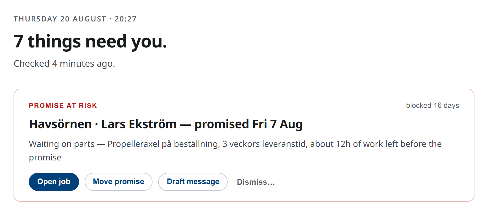

# Volodymyr Petrunin

**Java Backend Developer · Frontend with AI** · Gothenburg, Sweden

Building **[AquaTrack](https://aqua-track.work)**, an operations platform for Swedish boatyards, with AI agents
under my architecture and rules.

<b>How I work with AI</b>

1. Before every task the agent reads a written rulebook (architecture, security, a review checklist) and a
   memory of where the last session stopped.
2. It stays inside the task: anything it finds outside goes into a backlog for me instead of being fixed on its
   own, and architecture decisions change only on my say.
3. Before every big feature it interviews me on each open question, so we both know exactly what we want and
   how to build it.
4. The answers become one plan split into milestones. We build them one at a time and check each before the
   next starts, much like short sprints.
5. Every change comes with tests, and a task is done only when it passes the checklist: the build succeeds, all
   tests are green, and the architecture and security rules hold.
6. Then I test it by hand through different scenarios and send back what is wrong.

[LinkedIn](https://www.linkedin.com/in/volodymyr-petrunin-0316302b5/)
